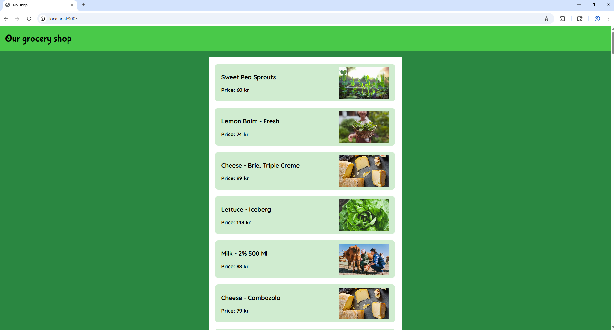
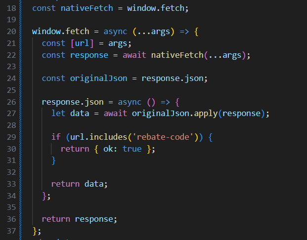
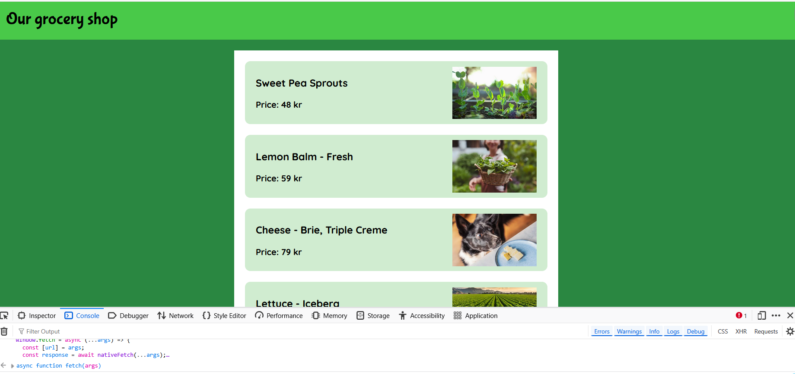
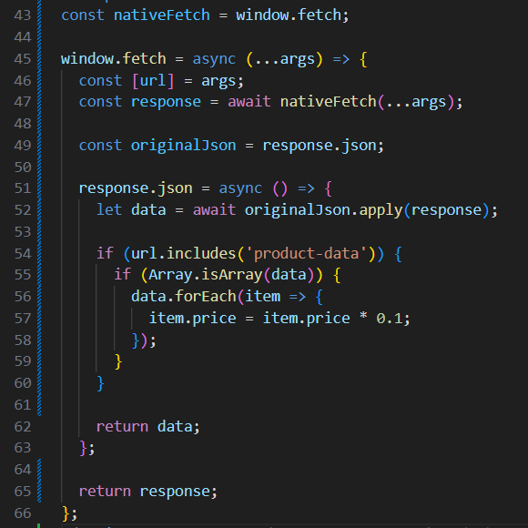
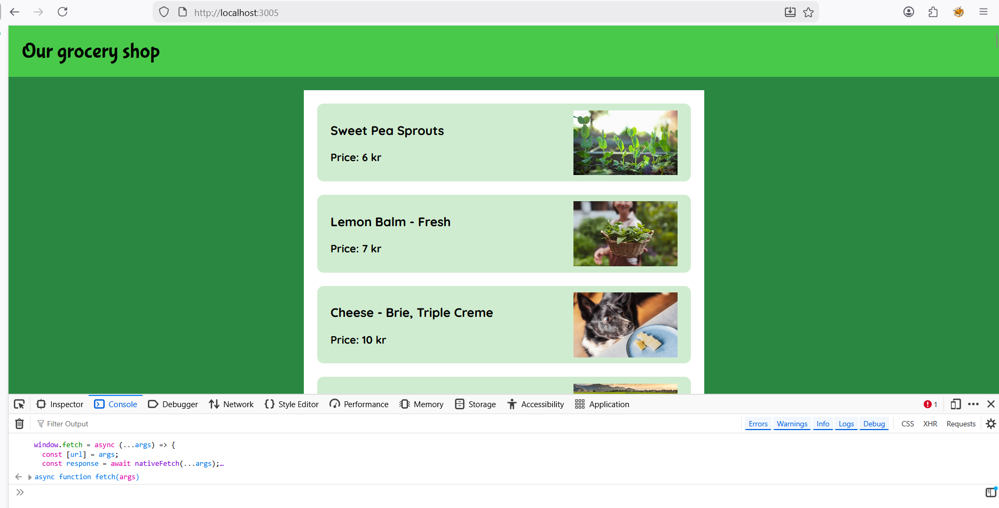

# Monkey-patch Attack lab report

The objective of this lab was to demonstrate how client side javascript can be manipulated through monkey patching to bypass business logic. Specifically, the attack targets the window.fetch API to intercept server responses, allowing a malicious actor to bypass discount code validations and modify product prices before they are rendered in DOM, also known as document object model.

## 1. The attack

The attack utilizes the dynamic nature of javascript. Since fetch is a global function, it can be redefined at runtime. By overwriting the native fetch function, we can inspect and alter the data flowing between the server and the user interface.

Steps taken:

1. Intercepting fetch by storing the original window.fetch in a constant to maintain the ability to make actual network requests.
2. Redefining the global function by assigning a new asynchronous function to window.fetch
3. Inside the wrapper, we awaited the response and intercepted the .json(). By applying custom logic to the returned JSON object, we could change the values before the applications UI logic received them. 

Note on methodology: As we have not had the time to learn scripting on javascript on a deeper level, AI tools were used to help structure the code for these intercepts, focusing on the logic of overwriting the global fetch function.

When first visiting the site, the user is greeted with a prompt to enter a discount code:

After clicking cancel, we see what type of products we have on the webpage.

## 1.1 Bypass rebate code
The application sends a request to validate a discount code. By intercepting the response from the validation endpoint, we forced the ok property to true.

**Result:**

## 1.2 Price manipulation
For the second challenge, we target the product data. We loop through the returned array of items and divide the price property by 10.

**Result:**

## 2. The vulnerability

The attack worked because the application logic relied entirely on client side trust. The frontend assumed that the data returned by the fetch call was immutable and authentic. Because javascript allows for the redefinition of global objects, the data was altered before it reached the display logic.

This vulnerability primarily falls under A04:2021 - Insecure Design. The design flaw lies in trusting the client environment to execute critical business logic without server side enforcement. It can also be related to A01:2021 - Broken Access Control as the client is essentially bypassing the access control of the discount validation.

## 3. Defense in depth

The primary defense is to never trust the client. While challenging the UI price is a visual flaw, the real risk occurs if the checkout system also trusts this client side data. If the final payment requests uses the price calculated in the browser, a malicious user could buy products for near zero cost. To avoid this, a site must never trust the client. All price calculations and discount validations must be reverified on the server side before a transaction is finalized.

To complement this server side validation, a Defense in Depth strategy should be employed to harden the frontend against manipulation. Implementing a strict Content Security Policy (CSP) is vital for preventing unauthorized script injections. Although a CSP cannot stop a user from manually executing code in their own developer console, it effectively mitigates XSS-based monkey-patching, where a third-party script might attempt to steal or modify sensitive data. Furthermore, Subresource Integrity (SRI) should be used to ensure that fetched scripts have not been tampered with, maintaining the integrity of the application's original logic.

For further protection, techniques such as code obfuscation can be utilized to increase the work factor for an attacker, making it significantly more difficult to identify and patch high value functions. Additionally, the server could cryptographically sign JSON responses, allowing the client to verify data authenticity. However, it is important to acknowledge that key management within a browser is inherently complex and often bypassable by a determined attacker. Ultimately, while these frontend measures provide valuable layers of friction, they serve as secondary defenses; the only true security boundary exists where the server independently validates every claim made by the client.

## Risk analysis

The likelihood of this vulnerability being exploited is categorized as High. This assessment is driven by the negligible ease of exploitation. An attacker requires no specialized tools as the entire attack can be executed through a standard browsers developer console.

The impact is rated as low with a caveat. From a technical standpoint the impact for this specific situation is low. Since monkey patching is performed locally in the users won execution environment, the attacker is essentially tricking themselves. There is no persistence and no propagation.

The risk is classifies as low because in a correctly architected system, the server would ignore the client side changes during the final transaction. A truly dangerous version of this attack would require a secondary vulnerability such as XSS to inject the monkey patch into other users browser. 