# SQL Injection lab report

## 1: Identifying SQL injection tactics

This is a simple local website displaying a product catalog that we are going to try to SQL inject without having any prior knowledge of its source code or backend logic. :

#### 1.1 Vulnerability verification

I first tested if the :id parameter was vulnerable to SQL injection by using a classic logical bypass:
http://localhost:3003/api/products/1 OR 1=1

The interface returned all products in the database. This confirms that the input is not sanitized, and the OR 1=1 statement (which is always true) overrides the original query logic.

#### 1.2 Determining column count

Before using a UNION attack, the number of columns in the original query must match the injected query. I used the ORDER BY clause to find the limit:

    .../api/products/1 ORDER BY 4 (Success)

    .../api/products/1 ORDER BY 5 (Error)

Success:
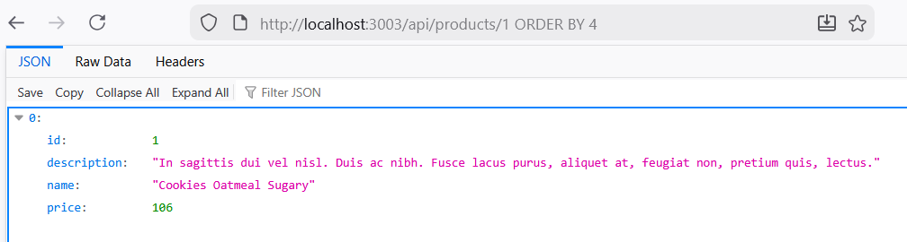

Fail:
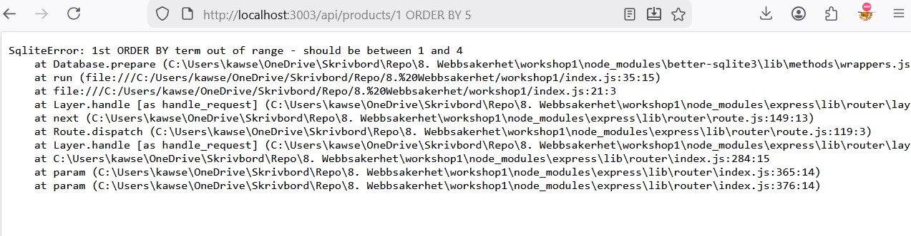

Since the query succeeded at 4 but failed at 5, the products table has exactly 4 columns.

### 1.3 Enumerating tables and views

Since the backend uses SQLite, I queried the sqlite_master system table to find all existing objects:
http://localhost:3003/api/products/-1 UNION SELECT name, type, 3, 4 FROM sqlite_master WHERE type IN ('table', 'view')

Results: I identified the following objects:

    Tables: products, users, and sqlite_sequence.

    Views: productNames.

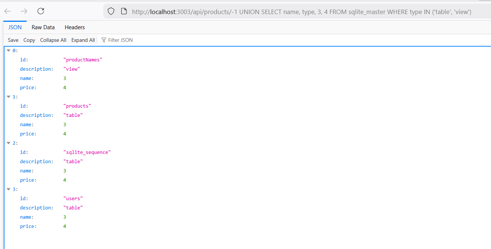

## 2: Extracting column names and data types

To extract the database schema, I queried the sql column in [sqlite_master](https://www.sqlite.org/schematab.html), which contains the original CREATE statements for each table.

Payload:
http://localhost:3003/api/products/-1 UNION SELECT sql, tbl_name, type, rootpage FROM sqlite_master WHERE type IN ('table','view')

Findings:
By analyzing the returned SQL strings, I mapped the structure of the users table:

    Table Name: users.

    Columns & Types: id (INTEGER), firstName (TEXT), lastName (TEXT), email (TEXT), password (TEXT), and userRole (TEXT).

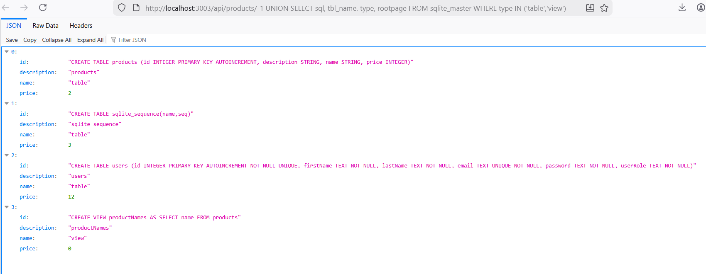

## 3: Data Exfiltration (Extracting Users)

With the table and column names identified, I performed a UNION SELECT to dump the contents of the users table.

Payload:
http://localhost:3003/api/products/-1 UNION SELECT firstName, lastName, email, password FROM users

Results:
The REST interface returned the full list of registered users, exposing their names, email addresses, and passwords.

## 4: Deletion of database

### 4.1 Safety measures

Before attempting any destructive operations, a backup of the database was created by duplicating products.db into product copy.db:
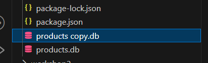

### 4.2 Attempt 1 (Failed):

My first approach was to attempt a stacked query injection by appending a second SQL commant to the URL:
Payload: http://localhost:3003/api/products/1;%20DROP%20TABLE%20products

Reults: The application crashed and returned a specific error:

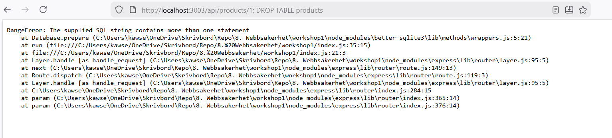

Analysis:
This confirms that the backend using the better-sqlite2 library. This specific library is designed with a security feature that explicitly forbids executing more than one sql statement in a single call to .prepare() or .run(). When it detected the semi colon and the second command it blocked the execution entirely to prevent exactly this type of destructive injection.

### 4.3 Attempt 2 (Success):

I switched tactics to exploit the DELETE route provided by the API. Using thunder client in VS code, I sent a DELETE request to the following endpoint:

http://localhost:3003/api/products/1 OR 1=1

How it works: The backend likely contructs the query as DELETE FROM products WHERE id = [INPUT]. By injecting 1 OR 1=1, the logic beocmes: DELETE FROM poducts WHERE id = 1 OR 1=1;
Since 1=1 is always true, the databse ignores the specific ID and applies the deletion to every row in the table.

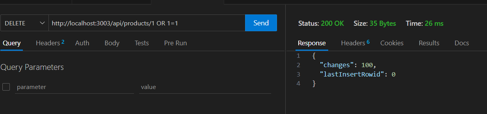

### 4.4. Verification

After executing the request, I refreshed the product page. The interface returned an empty page, confirming the products table had been successfully wiped.

## 5. The vulnurabilty

The fundamental reason for these attacks being successful is a failure to separate code from data. The application treats user supplied input as part och the executable sql command than as a literal value.

The backend contructs queries by concatenating variables directly into a string. When the input 1 OR 1=1 was provided, the sql interpreter could not distingueish between the developers intended logic and the attackers injected logic, leading to a bypass of the WHERE clause.

The application incorrectly assumed that the :id parameter would always be a simple integer. By failing to validate or sanitize the input before passing it to the database engine, the trust boundray between the untrusted user and the sensitive database was breached.

Whitle the better-sqlite2 library blocked stacked queries, it providied to protection against union based or inferential attacks. This demonstrates that relying on a librarys default security features is not a subtitue for secure coding practices.

This vuln is categorized under [A03:2021 - Injection](https://owasp.org/Top10/2021/A03_2021-Injection/). Injection is ranked as the third most critical web application security risk. It occurs when untrusted data is sent to an interpreter as part of a command or quer. In this lab, this resulted in a lodd of confidentiality and availability when we dumped the user table and wiped the products table.

## 6. The defense

This is our current backend
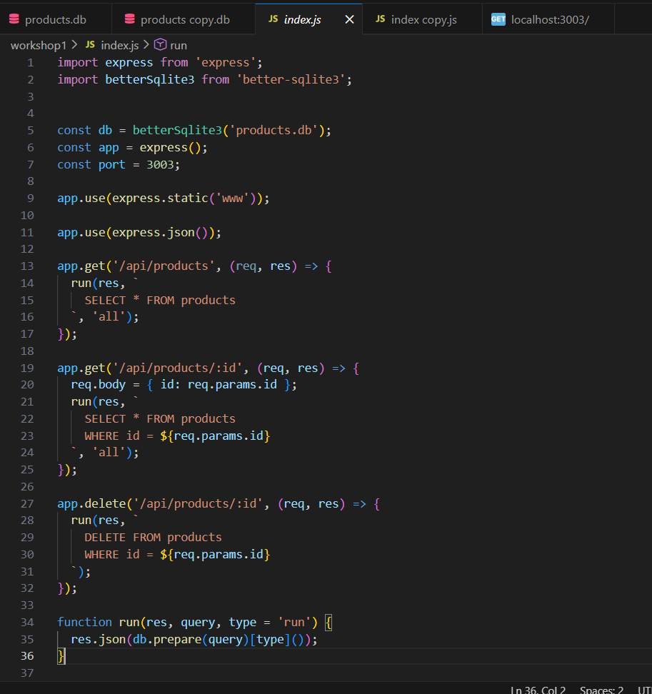

Lets go through each function and evaluate their vulnurabilities.

### Function 1:

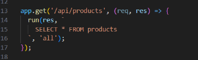

This function selects everything from the table. It doesnt take any input from the user. Because it doesnt combine user data and sql, there is no risk of injection. So we dont need any defense for this.

### Function 2:

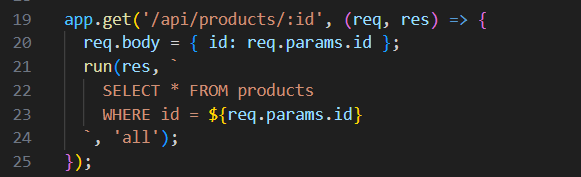

Here it takes the value directly from the url and places it directly to the SQL query with the help of ${}. An attacker kan change the ID in the web browser to 1 OR 1=1. The qeury then becomes WHERE id = 1 OR !=1, which returns all rows instead of just one. They can use UNION SELECT to steal data from other tables.

A more secure verision

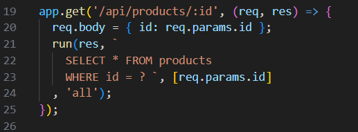

The most important change is the move from a string building approach to a template drivern aproach. In the original code we were using java scropt tempate literals, those backsticks and the ${} syntax to contruct the SQL command. The original code was was hackable in the context of a database because it merges the command and the data to a single entity before it ever reaches the database engine. This creates a situation where the database cannot tell the difference between a legitimate ID and a malicious command like 1 OR 1=!, which would trick the system into revealing every product in the table.

In this secure verision we have inplemented what is known as a prepared statedment. Instead of baking the ID directly into the string we now use a question mark as a placeholder. Furthermore we made a subtle but an important change by switching the method from .all() to .get(). In the original verision, the .all() would always return an arrap, even if there was only one result. However, because and ID is typically a unique identifier, we are only ever expecting a single procut. When using the .get(), the library returns the product as a single object, ehich makes the API reponse much easier for the frontend to handle.

Technically this process happens in two phases. First, db.prepare(query) sends the SQL blueprint to the databse engine where it is parsed and compiled. Once that structure is locked in, the second phase occurs when we call .get(params), where the engine safely plugs the data into the hole left by the question mark. This separation is the standard for database security. It ensures that the logic of our code remains unchanged and that the users input remains nothing more than passive data.

### Function 3:

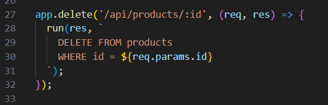

Here we have the same problem as the previous function but its worse because if we send 1 OR 1=1 as ID here, the database will run DELETE FROM products WHERE 1=1. We saw that this deleted the entire databse in instantly.

Secure verision:

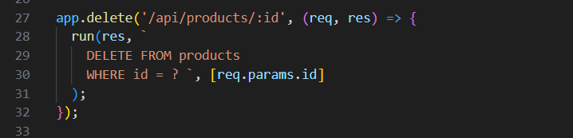

The DELETE function is signifacntly more dangerous than the GET fucntion beause its misuse results in permanent loss of data rather than just a data leak. To secure the code, we replaced the the vulnurable string building (using ${}) with a prepared statement. After this fix, we are ensuring that the users input is treated only as piece of data. Which is essentially the same principle we use in the previous function.

### Helpfunction

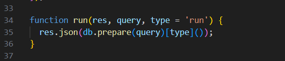

This is function is designed to accept accept only two arguments: the reponse object and the sql query string.

Thr main issue with this structute is that it lacks flexibility. Because the fucntion only accepted a single query, it essentially required us to include all data, directly within the string. This design made it diffcult to practive seucre code. If we wanted to include a users ID or name, we were forced to use techniques like string concatenation or template literals. As we have seen, this is exactly what leads to sql injection.

The secure verision:

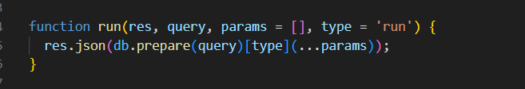

To resolve this, we modified the function to accept a third argument, which we call params. This argument is an array that holds any external data we want to send to the database.

The importance of this change lies in how it enables the use of prepared statements throughout the enitre application. By adding the params array we can now use placeholds in our sql strings. When we call db.prepare(query)[type](...params), the library handles the communication with the database in a way that keeps the sql ocmmand and the user data separate.

### Verification

To verify the attack no longer works after securing the code, lets recreate some of our previous attacks but in thunder client to get a more detailed response.

GET with 1=1
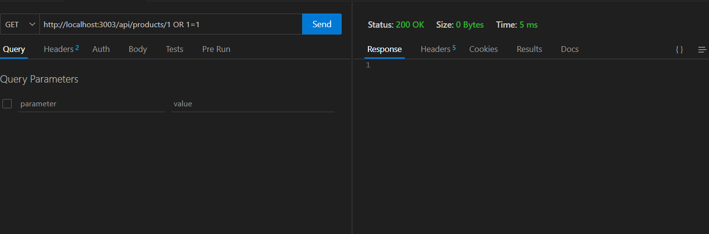

DELETE

In the original code, the input would have manipulated the logic to return every product in the database and delete all the products in the second image. If that were happening, we would see a larger response size containing all the product data. However the image shows a size of 0 bytes and an empty reponse body. For the delete request we have 0 changes which means it didnt delete anything like it previously could. The database is now searching for a product that has an ID matching that exact string. With that saide, we have successfully moved from a system that was not secure to a more secure one.

### Blind SQL injection

I noticed after securing this lab that the sql injections didnt return any message on the site. So I did some digging and stumbled upon a concept called "Blind SQL injection".
This is what I have learned: while the lab allowed for direct data extraction because the API returned database content or errors on the screen, it is important to acknowledge more advanced techniques such as Blind SQL injection.

In eviromenets where the application does not display database output or detailed errors, an attacker can still exfiltrate data by observing the servers behavior. This can be done through boolean based attacks, where the attacker checks if the page looks differently based on the true or false statement. Or time based attacks where the database is instructed to pause for a specific duration if a condition is met. Simply supressing error messages or hiding data from the user interface doesnt truly secure the application against a determined attacker.

### Defense in depth

Beyond the code level, the database should be configured following the principle of least privilege. This prinicple makes sure that the application account lacks the permissions to drop tables or access system schemas like sqlite_master. Furthermore implementing strict input validation as an intiial filter ensures that only expected data types, such as integers for an ID are even processed.

## 7. Risk analysis

This labs deomnstration of the vulnurabilities resulted in a total compromise of the CIA triad. The outcomes highlight that the impact of a single injection flaw extends beyond technical errors to significant risks such as data loss, legal non compliance and service disruption. This application represent a critical risk according to the OWASP Risk Rating Methodology, which evaluated risk based on the combination of the likelihood and impact.

Likelihood: High
This is high hue to the ease of discovery. The vulnurability exposed directly through the URL parameter, requiring no specialized tools or authenticated access to identify. Since the application intially returned database errors, an attacker could quickly map the database structure and execute successfull injection attacks.

Impact: High
The technical impact is severe as the vulnuerability allows for a complete compromise of the CIA triad. Condidentiality was lost when the UNION SELECT attack allowed unauthorized access to the users table and its sensitive credientials. Integrity was breached because of the application allowed the modification of the database logic through the URL, enabling an attacker to manipulate or bypass intended data constraints. Availability was severly impacted when the DELETE and DROP TABLE commands successfully wiped the product database, rendering the service non functional.

The combination of high likelihood and high impact results in a critical severity rating.
