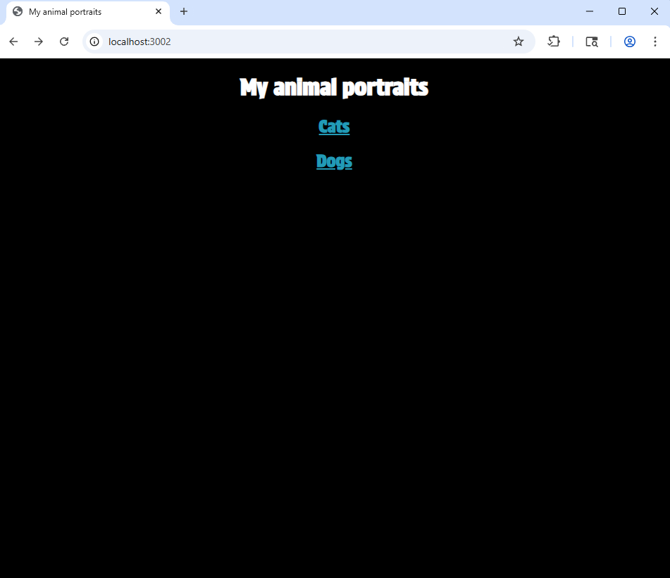
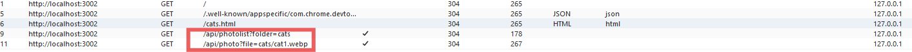
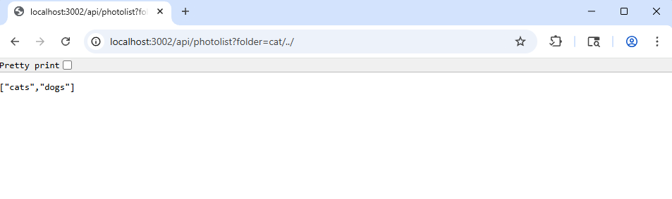
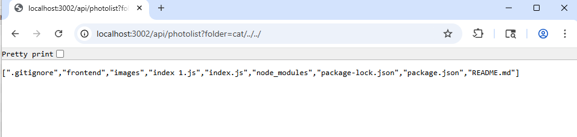
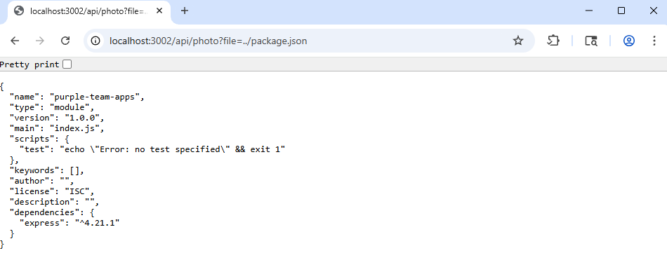
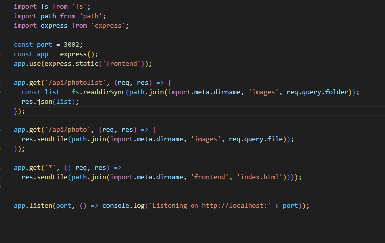
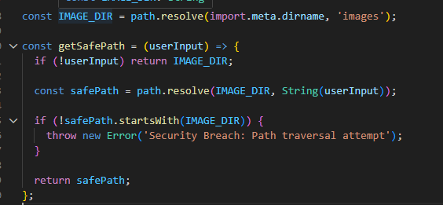
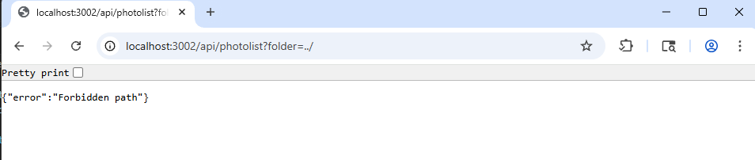
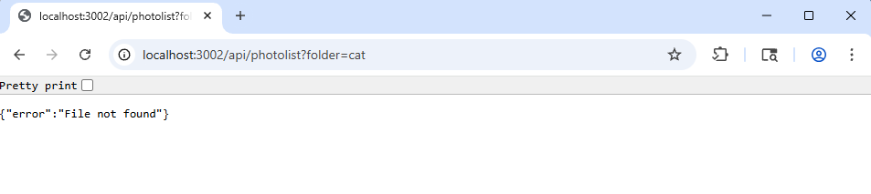

# Traversal Attack lab report

The objective of this report is to evaluate the security of a newly deployed photography web application. The goal is to determine if the application is vulnerable to unauthorized data access, specifically through Path traversal techniques.

## 1. The attack:

By examining the web traffic using Burpe suite, a specific endpoint was identified responsible for fetching image data:

Endpoint: api/photolist?folder= & api/photo?file=

The first task is to list all folders on the server. Tested folder parameter in the api/photolist endpoint to see if it would accept relative path markers.

Appending /../ to the folder name moved us up one level from the intended image directory. The result:

By appending another sequence we were able to reach the applications root directory where we can see the entire project structure:

The second part is to retrieve the actual contents of a file. For this the target was api/photo endpoint which seemed to be designed to serve image files. The URL: localhost:3002/api/photo?file=../package.json returned the content of package.json exposing dependencies and internal metadata:

## 2. The vulnerability and defense:

This vulnerability is classified under A01:Broken Access control. This category is the most critical risk for web applications and occurs when an application fails to enforce restrictions on what users can access. In this case, the lack of input sanitization allowed an unauthorized user to navigate the servers file system.

The original application was vulnerable because it trusted user input implicitly. In the image below, req.query.folder and req.query.file are passed directly into the file system functions without any sanitization. Because path.join concatenates strings, an input of ../ allows the pointer to move out of the images directory and into the systems root folders.

To secure the application, a function was implemented which uses Path canonicalization and Prefix validation. path.resolve calculates the absolute path. If a user inputs cat/../../, the function resolves this to the actual folder on the hard drive, stripping away the navigation logic.

startsWith(IMAGE_DIR) is the important check which ensures that even if the user tries to jump back, the resulting path must still begin with the authorized images directory. If it starts with anything else, the application throws an error.

## 3. The verification

# 4. Defense in Depth

At the application layer our current fix serves as the first line of defense. However, this should be supported by the Principle of Least Privilege at the operating system level. The node.js process would never run with admin or root privileges instead it would operate under a restricted service account that possess only read access to the specific directories required for its function such as the frontend and images folders. This makes sure that even if a new vulnerability were discovered that allowed a user to bypass our new function, the underlying operating system would still block any attempt to read sensitive system files or private SSH keys.

At the infrastructure layer we can enforce security through the use of a reverse proxy, such as nginx or waf. These tools can be configured to inspect incoming HTTP requests and automatically drop any traffic containing suspicious patters before they ever reach the backend application. This creates a secondary barrier that filters common automated attacks.

# 5. Risk Analysis

The likelihood of this attack occurring is High because the vulnerability is trivial to discover and execute. By simply observing the API traffic for the /api/photolist and /api/photo endpoints, an attacker can see that the application uses invalidated strings to fetch data. Exploitation requires no specialized tools or advanced knowledge; a user only needs to append the ../ sequence to a URL parameter to begin navigating the server's file system. Because the original code directly concatenates these user-provided strings into the file system path, the barrier to entry for an attacker is non-existent.

The impact is similarly rated as High. Through this flaw, we successfully demonstrated the ability to list the entire project directory, exposing sensitive files such as the backend source code and configuration files. Specifically, the retrieval of package.json highlights a major breach of confidentiality, as it reveals the application's internal dependencies and metadata. In a live environment, such access often leads to the discovery of hardcoded credentials or environment variables, potentially granting an attacker full control over the host machine.

Given that both the likelihood and impact are high, the overall risk severity is classified as Critical. This vulnerability represents a fundamental failure in Broken Access Control (A01:2021), as the application fails to enforce any boundaries between public web content and private server files.
