# XSS Attack lab report

The goal of this workshop is to identify and exploit vulnerabilities within a web application. We are provided with the following administrative credentials and technical details:

**superadmin username** = anna.larsson@gmail.com

**superadmin password** = 12345678

**target rest route** = REST-route PUT /api/edit-my-user-info

This is the initial view of the site and what we have to work with:

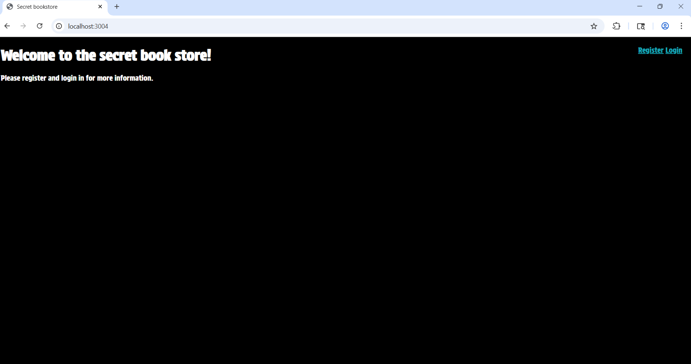

## 1. Redirecting attack (Stored XSS)

From the first view we can notice that we can register an account. First I want to register with something harmless that changes the UI before doing anything destructive. For this I will do a simple HTML injection when registering an account. So we will try and enter this in the name field:

payload: `<h1>Hello</h1>`

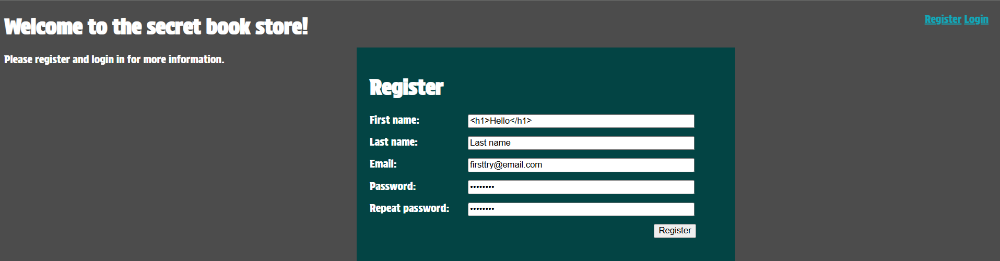

Result:

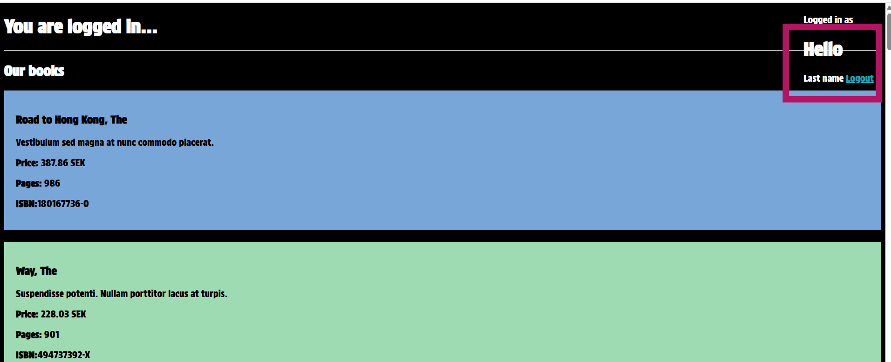

Now we got our proof of concept. Since the browser rendered the `<h1>` tag as a heading instead of plain text, we have confirmed that the application is vulnerable to HTML injection, which means it is also vulnerable to XSS.

## 1.1 Executing XSS Redirect

Building on the HTML injection discovery, I will escalate the attack using a Stored XSS payload. Meaning, we recreate the same thing as the html injection but this time we are doing an XSS img on error attack. TThis payload is designed to redirect any user who views my profile data to an external site, this case a site called: expressen.se

Payload: ``

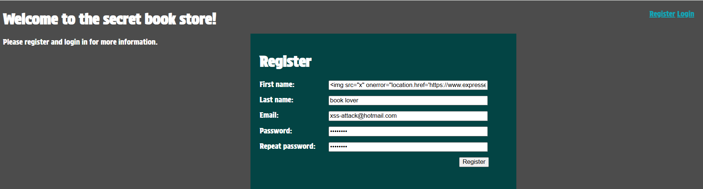

Upon logging in the newly created account, the attack triggered successfully. The browser attempted to load the non existent image "x", which fired the onerror script and redirected the session to Expressen.

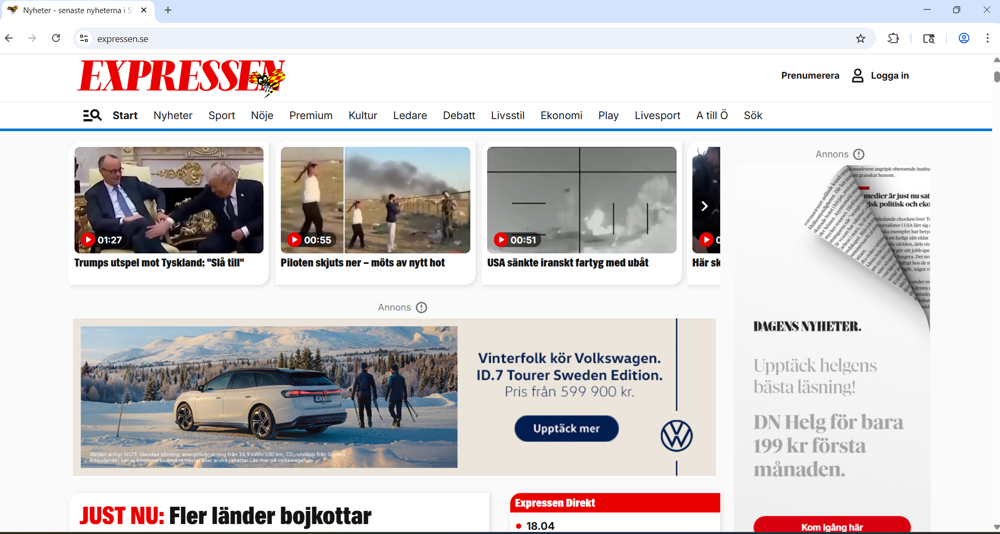

Reading the response in Burp suite, it shows us that it couldn't find the original site. We don't see the express.se in Burpe suite because it created a brand new session and I didn't tell it to intercept all traffic, bad mistake from me but we see that the site is not working as intended anymore and that our stored XSS injection worked.

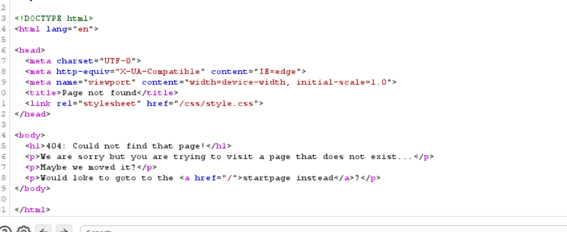

To confirm the impact on other users, I logged in with the Superadmin credentials (anna.larsson@gmail.com). As expected, the stored payload triggered immediately, redirecting the admin session to Expressen.se and effectively rendering the dashboard unusable.

## 2. Privilege escalation

### 2.1 Discovery

By analyzing a previous HTTP response in Burp Suite, I identified the internal key used for user permissions: "userRole": "user". We also have the access to PUT /api/edit-my-user-info, intended for updating user details.

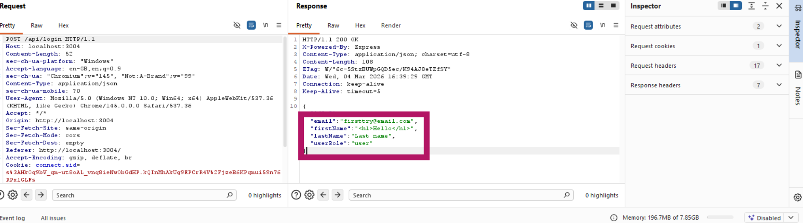

The goal is to become superadmin, we know the key to change and we have the target route. To do this. I first created a brand new account. I then went to burp suite and found the POST /api/login in my HTTP history and selected repeater.

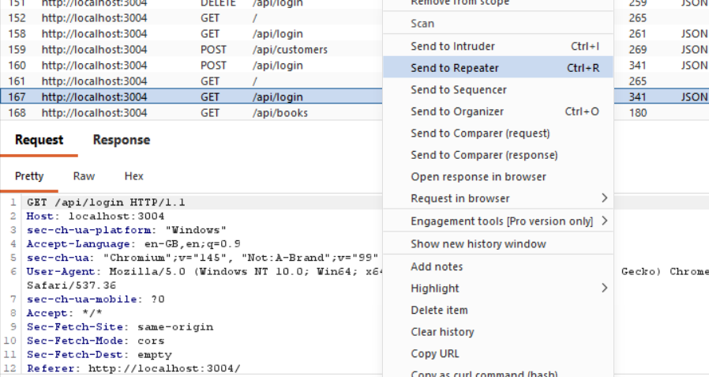

In the repeater tab, I modified the request to target the edit route. I changed the top line and body to look like this:

**Request:**

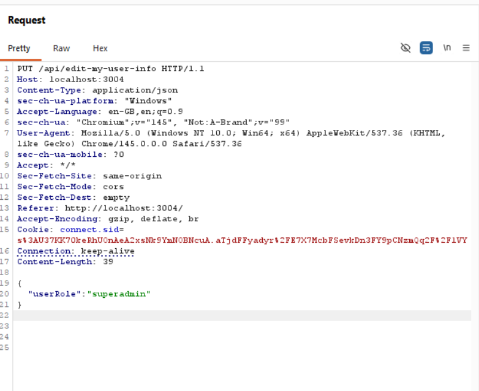

I crafted a manual request to the target endpoint:
Method: PUT
Endpoint: /api/edit-my-user-info
Headers: Added Content-Type: application/json
Payload: Added "userRole": "superadmin" to the JSON body.

**Response:**

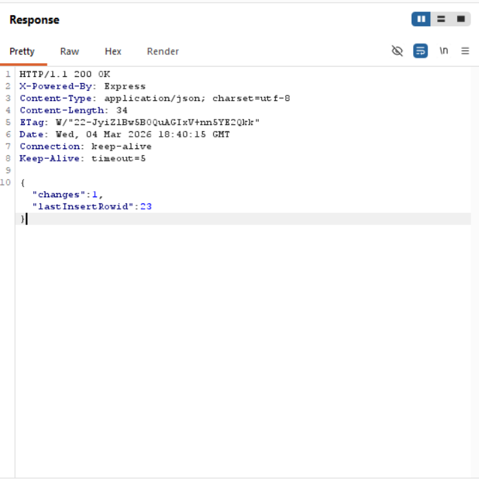

After some failed tests because of syntax, the server accepted the request and responded with a 200 OK. The response confirmed that one change was successfully made to the database record.

After refreshing the browser, my standard user account gained access to restricted administrative features proving that I had successfully escalated my privileges to superadmin.

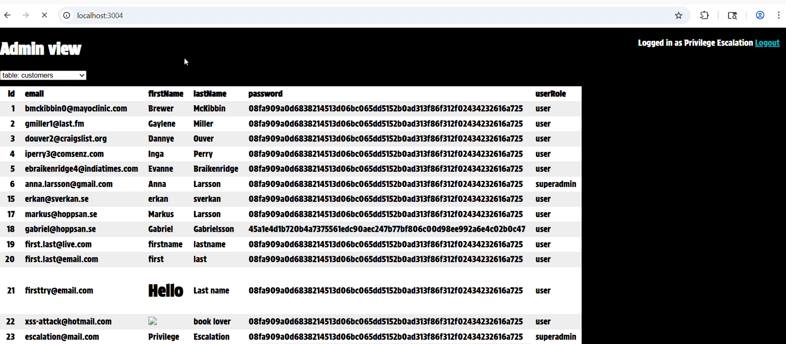

# 3. The vulnerability

The success of these attacks stems from a fundamental lack of input validation and strict access control mechanisms within the applications architecture. In the case of the Stored XSS attack, the vulnerability exists because the backend code fails to sanitize or encode user provided strings before storing them in the database and subsequently rendering them in the frontend. Specifically the application likely uses a method such as innerHTML or fails to use an auto escaping templating engine, which allows the browser to interpret the data as executable code rather than literal text.

The vulnerability falls under A03:2021 - Injection in the OWASP TOP 10, as the application allows untrusted data to be injected into the web page structure.

Regarding the Privilege Escalation, the attack was made possible by a MAss Assignment flaw. On the server side, the code for PUT /api/edit-my-user-info route takes the entire req.body object and applies it directly to the database record using a generic update statement. This lack of Data Transfer Object also (DTO) or an allow list of editable fields means that sensitive properties like userRole are left exposed to any authenticated user. This vulnerability is categorized under A01:2021- Broken Access Control, as it allows as user to act outside of their intended permissions.

# 4. The defense

To achieve a higher level of security, a Defense in Depth strategy must be implemented. Simply sanitizing input as the entry point is rarely sufficient, as filters can often be bypassed within sophisticated encoding. Instead a multi layered approach is required. For XSS, this involved implementing a strict CSP, Content Strict Policy to prevent the execution of unauthorized scripts and ensuring that the frontend uses context-aware output encoding.

For the REST API, the principle of Least Privilege should be applied. The system should not only use allow lists define which fields are editable but also perform server side validation to ensure that a suer can never modify their wn role. A major limitation of simple fixes is that they often rely on the developer remembering to secure every new endpoint. By shifting toward Fail-sade Defaults, such as using restricted database schemas and centralized authorization middleware, the system becomes resilient even if individual developes make mistakes. Security is not a single barrier but a series of overlapping controls that ensure if one layer fails, the broader system remains protected against exploitation.

Now that we successfully demonstrated the attack, we are allowed to look at the code structure and learn how to secure these types of attack.

After examining the codebase, I found rest-api.js as a primary source of vulnerability. Rhe application utilizes a dynamic routing system that generates endpoints for database tables.We also notice the imported modules, a particularly interesting module we will be visiting later is "specialRestRoutes":

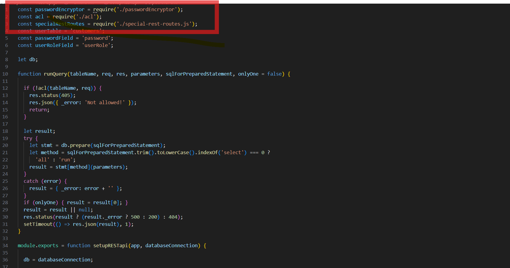

This runQuery function and the generic POST and PUT routes were found to take raw values from req.body and pass them directly into the database driver without any validation or sanitization.

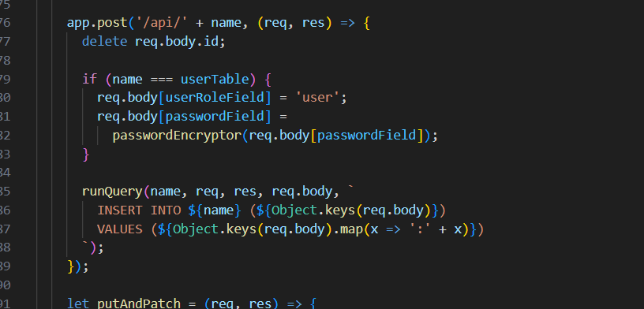

Furthermore, the putAndPatch function was identified as a root cause for privilege escalation. The code iterates through every key provided in the req.body and dynamically appends it to the SQL UPDATE statement. If an attacker includes userRole in their JSON payload, the server blindly updates that column, allowing for unauthorized permission changes.

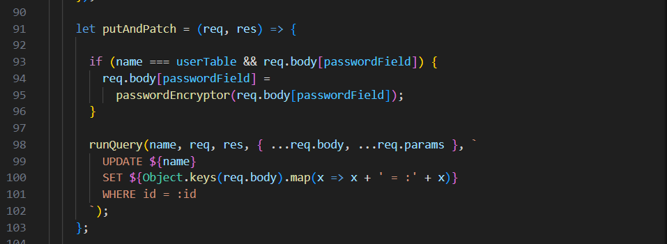

## 4.1 Securing rest-api.js

To secure this file, I added a sanitize helper function that escapes < and > characters, effectively neutralizing HTML tags.

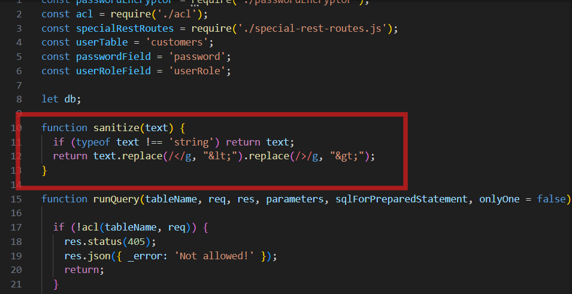

Then I integrated this function into the app.post route:

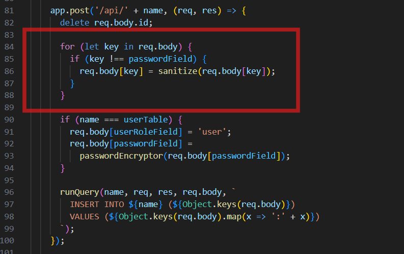

And the putAndPatch function:

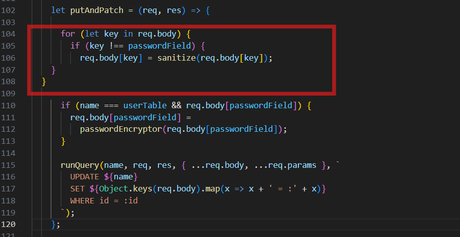

Now the INSERT and UPDATE commands are safe from XSS payloads, atleast theoretically so far, before we finally test everything.

## 4.2 Securing special-rest-routes.js

Moving on to the other file: special-rest-routes.js

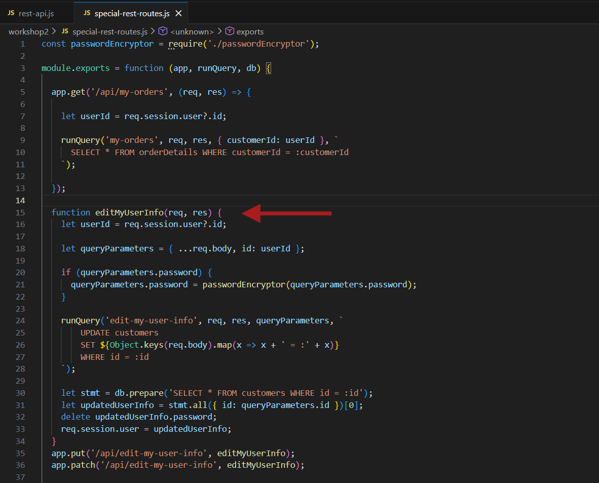

The function editMyUserInfo is the catalyst for the privilege escalation. Just like in rest-api.js, the code uses Object.keys(req.body).map(...) to dynamically build SQL UPDATE statement. This means if the user sends userRole in their JSON, the server blindly updates that column in the customers table.

To achieve a more secure code we are going to implement Allow listing and input sanitization. We will define exactly what user is allowed to touch.

- Layer 1 = Allow listing: Stripped out any fields from req.body that aren't firstName, lastName, email or password.

- Layer 2 = Sanitization: Cleaned the strings to remove HTML tags, preventing Stored XSS

- Layer 3 = Session Security: The code was modified to ensure the userID is pulled exclusively from the secure req.session. This prevents an attacker from attempting to modify another users profile by changing an ID in the request body.

By mapping over a filteredBody instead of the req.body, the application is now guaranteed to ignore unauthorized fields, effectively killing the privilege escalation vulnerability.

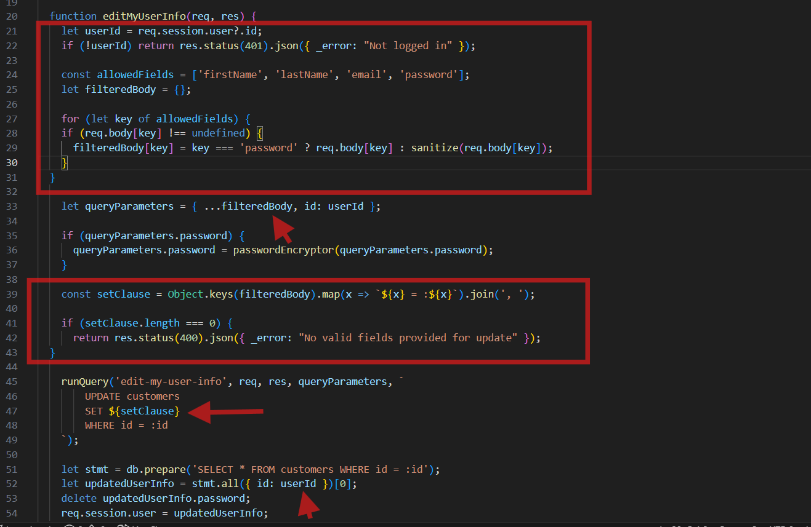

## 4.3 Verification

After of course debugging for a while because of running into some more syntax problem I finally got to the book store site live. And we can now test these layers of protection we added.

1. Created a new normal account. 2. Recreated both the attacks in the response header in Burp suite and got a response with one change:

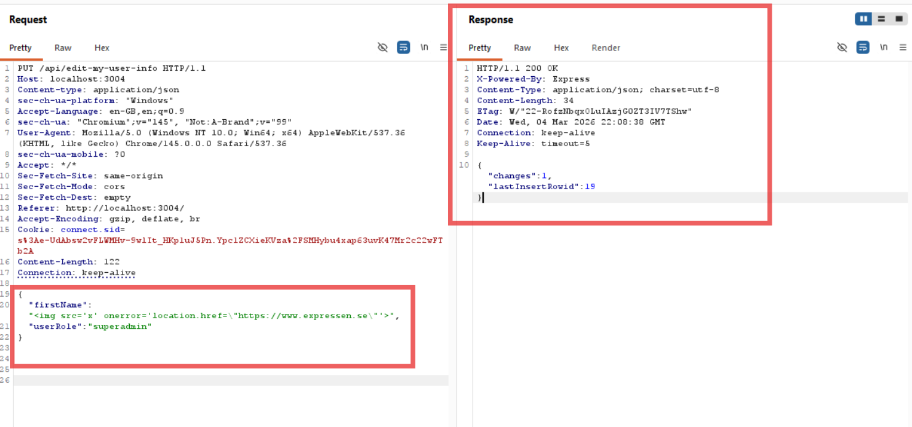

The response got me worried for a second because why is there a change? But looking at the site it makes a lot of sense:

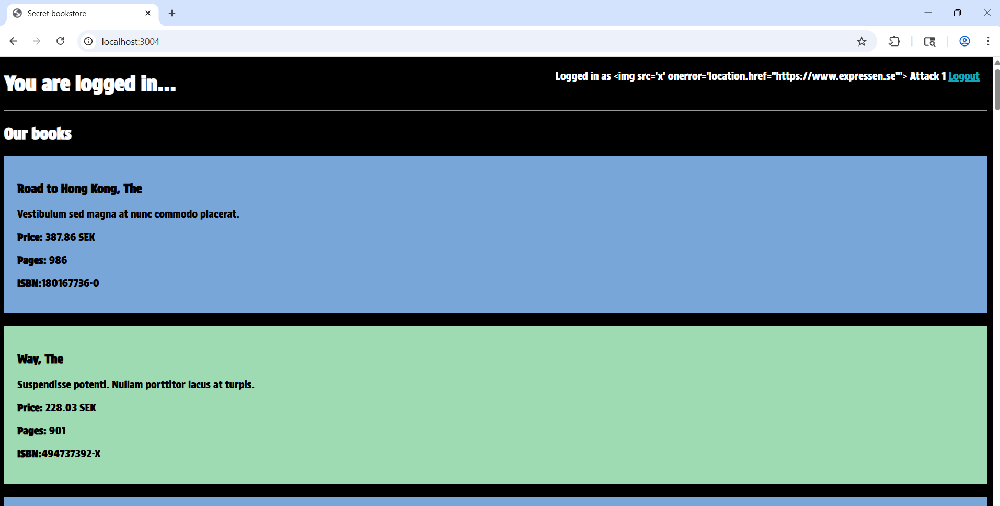

The change was the username to the xss injection but in string! It also confirmed that the escalation failed!

# 5. Risk analysis

Stored XSS:
The likelihood of this attack is High. The vulnerability is in a public registration form. It is very easy to find. Any user can test if the site renders HTML by typing `<h1>` into the name field. Escalating this to a redirect script requires no special tools. The impact is also High. We proved this by redirecting the Superadmin to an external site. This makes the admin dashboard unusable. In a real attack, this could be used to steal session cookies or passwords.

Privilege escalation:
The impact here is Critical. Using Burp Suite, we saw that the JSON response reveals the userRole field. The server uses a "Mass Assignment" pattern. It blindly accepts any data sent in the request body. This makes the likelihood of an attack very high for anyone using a proxy. A standard user can simply craft a PUT request to change their own role to "superadmin." This breaks the entire security model of the site. The admin boundary is completely gone.

Given that both the likelihood and impact are high across these vectors, the overall risk severity is classified as Critical because a sophisticated attacker could chain these flaws.